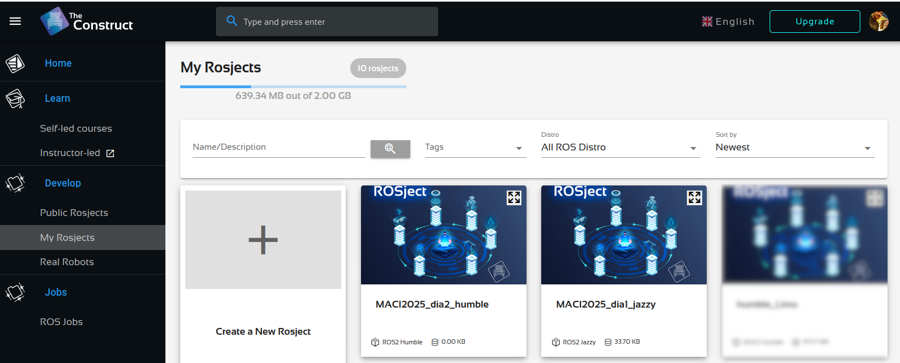
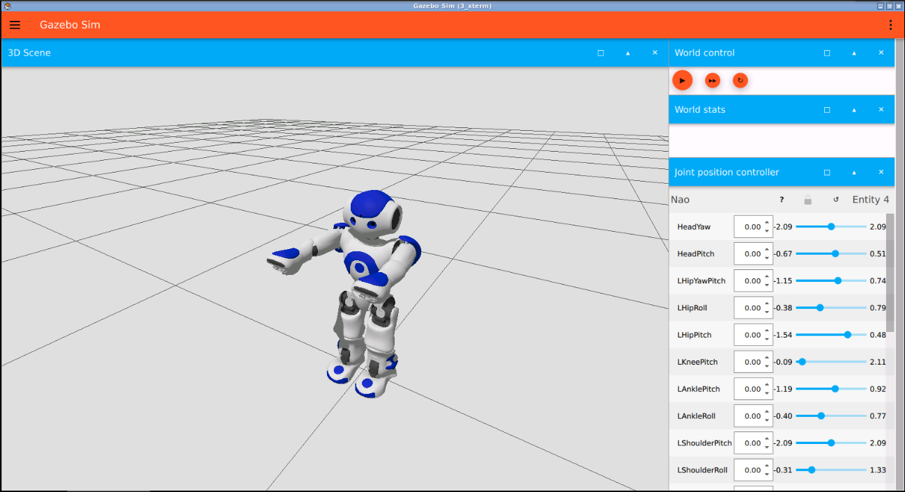

# Actividades prácticas del Día 1

## Creación de proyecto
Para poder utilizar el simulador Gazebo es necesario crear un nuevo proyecto (Rosject) dentro de `TheConstruct`:
* Seleccionar _"Crear un nuevo Rosject"_ o _"Create a New Rosject"_ (recuadro con signo "+").
    <div align="center">
      
    </div>
* Seguir los siguientes pasos:
    1. Seleccionar la distribución ROS: elegir _"Jazzy"_.
    1. Seleccionar la simulación a utilizar: elegir _"Crear desde cero"_ o _"Create from Scratch"_.
    1. Asignarle un nombre al proyecto.
* Una vez creado el proyecto (Rosject) ejecutar con el botón _"Ejecuta_" o _"Run"_.

El entorno ROS de `TheConstruct` consiste de diferentes ventanas flotantes sobre las que se pueden realizar las acciones comúnes a cualquier ventana: redimencionar, mover, abrir, cerrar, etc.

## Ejecución del simulador Gazebo Sim

* Para poder ejecutar el simulador _"Gazebo Sim"_ hay que abrir una ventana de línea de comandos o Shell. El primer botón (al lado del reloj) de la barra de botones (símbolo `>_`) en la parte inferior, permite abrir la ventana de la Shell.
    <div align="center">
      
    </div>

* En la ventana de la shell ejecutar:
    ```
    gz sim
    ```
    (escribir el comando indicado y presionar ENTER)
* Se deberá abrir una nueva ventana que muestra un escritorio remoto o virtual, donde se mostrará la ventana _"Gazebo quick start"_ del simulador.
    <div align="center">
      
    </div>
* Para lanzar uno de los escenarios de simulación, seleccionar el escenario y presionar el botón _"Run"_.
* Una vez abierta la ventana del simulador Gazebo presionar el botón _"Run the simulation"_ (botón color naranja con el símbolo de play).

## Actividades
Ejecutar las simulaciones de los siguientes escenarios del _"Gazebo quick start_"
1. Nao Joint Control
1. Quadcopter Teleop
1. Tugbot In Warehouse

### 1. Control de uniones/joints del robot Robot Nao
* Ejecutar el escenario de simulación con el robot Nao.
* Actuar los controles deslizables que se encuentran en el panel _"Joint position controller"_.
* Mover e identificar cada una de las uniones o joints del robot.

<div align="center">
  
</div>

### 2. Teleoperación de cuatrirrotor
* Ejecutar el escenario de simulación con el cuatrirrotor (quadcopter).
* Actuar sobre los botones que se encuentran en el panel _"Teleop"_ (teleoperación).

<div align="center">
  
</div>

### 3. Teleoperación de robot AMR en almacen
* Ejecutar el escenario de simulación con el robot Tugbot (almacen industrial).
* Actuar sobre los botones que se encuentran en el panel _"Teleop"_ (teleoperación).
* Mover el robot a diferentes lugar del almacen.

<div align="center">
  
</div>

