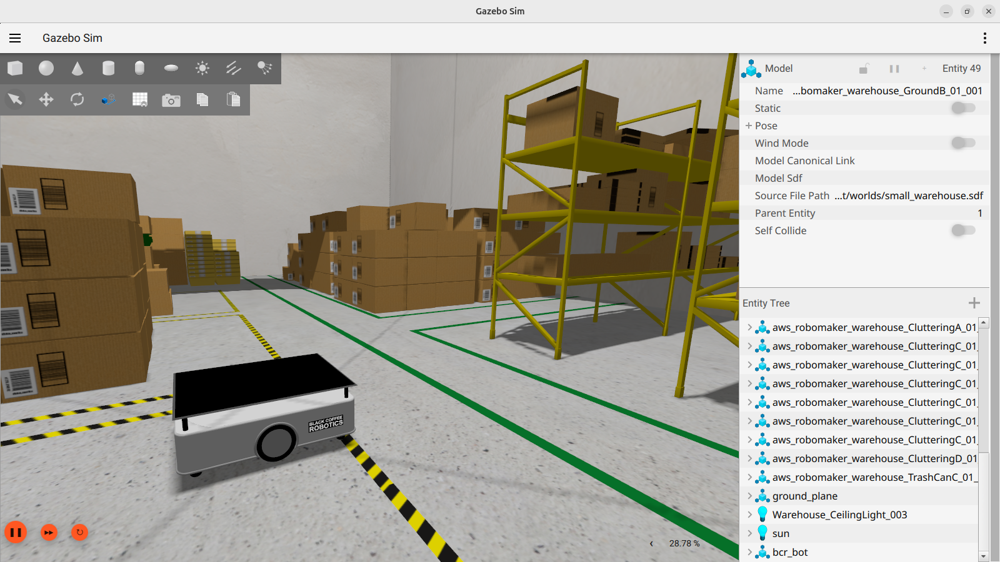
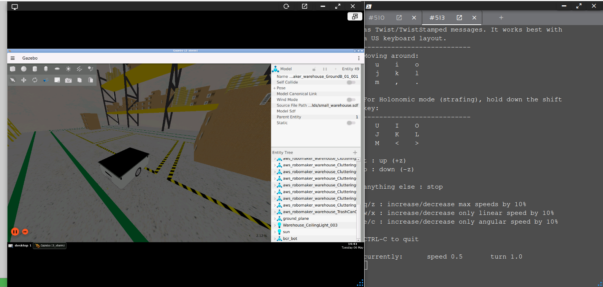
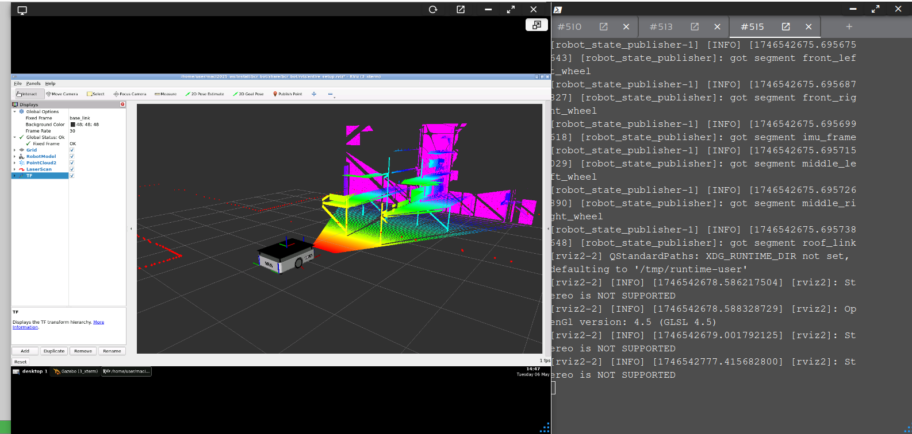

# Actividades prácticas del Día 2

Las actividades indicadas a continuación consisten en poner en marcha la simulación del robot [`bcr_bot`](https://github.com/blackcoffeerobotics/bcr_bot) en Gazebo, realizar la teleoperación con ROS y visualizar la información de los sensores con [RViz](https://docs.ros.org/en/jazzy/Tutorials/Intermediate/RViz/RViz-User-Guide/RViz-User-Guide.html).

## Creación y ejecución de proyecto Rosject
* Crear un nuevo proyecto Rosject en [The Construct (Robotics Institute)](https://www.theconstruct.ai/) de forma similar a lo indicado en [Prácticas1](PracticaDia1.md). En este caso seleccionar _"Humble"_ como distribución ROS.
* Seleccionar un entorno de simulación vacío.
* Ejecutar el nuevo proyecto Rosject y lanzar una ventana de Shell.

En las actividades indicadas a continuación se necesitarán tener activas varias ventanas Shell.

## Instalación y ejecuión del modelo de simulación `bcr_bot`
Los siguientes pasos consisten en descargar el modelo de simulación del robot [`bcr_bot`](https://github.com/blackcoffeerobotics/bcr_bot), construir los paquete ROS y ejecutar la simulación.

1. Crear un espacio de trabajo ROS, descargar el repositorio y construir el proyecto; ejecutando los siguientes comandos uno por uno:
    ```
    mkdir -p $HOME/maci2025_ws/src
    cd $HOME/maci2025_ws/src
    git clone https://github.com/blackcoffeerobotics/bcr_bot.git
    cd $HOME/maci2025_ws
    colcon build --packages-select bcr_bot
    ```
1. Ejecutar la simulación:
    ```
    source install/setup.bash
    ros2 launch bcr_bot gz.launch.py
    ```
    Al momento de ejecutar la simulación no se visualiza el robot. Para un ajuste rápido se puede utilizar el panel derecho _"Entity Tree"_, hacer click derecho sobre el modelo `bcr_bot` y luego elegir _"Move To"_.

    <div align="center">
      
    </div>

## Teleoperación ROS mediante teclado
En una nueva Shell ejecutar la teleoperación con ROS:
```
source $HOME/maci2025_ws/install/setup.bash
ros2 run teleop_twist_keyboard teleop_twist_keyboard cmd_vel:=bcr_bot/cmd_vel
```
<div align="center">
  
</div>

* La aplicación de teleoperación muestra información en pantalla donde se indica qué teclas se deben utilizar para mover el robot.
* Mover el robot por el entorno de simulación.

## Visualización de mediciones de sensores con RViz
En una nueva Shell ejecutar la herramienta de visualización RViz:
```
source $HOME/maci2025_ws/install/setup.bash
ros2 launch bcr_bot rviz.launch.py
```
<div align="center">
  
</div>
